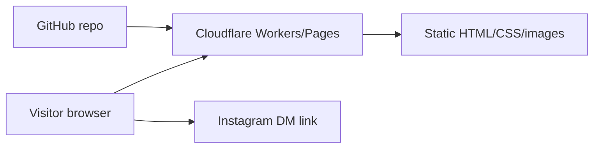
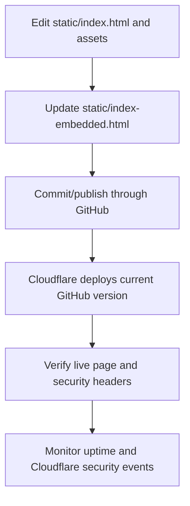

# Security and Operations Checklist

Last reviewed: 2026-07-23

Site: https://nia-hagler.gavgrass.workers.dev/

Repository: Gavin-Grass/nt-training

## Applicability summary

This website is a static public marketing site. The visitor can read content and click an Instagram link, but the site itself does not accept form submissions, store user accounts, process payments, expose API routes, or write to a database.

| Requirement | Status | Notes |
| --- | --- | --- |
| Environment variables | Not applicable | The deployed static page does not need runtime secrets or environment-specific config. |
| `.env` files | Pass | `.gitignore` excludes `.env*`; do not commit local secrets. |
| Markdown docs | Pass | `README.md` and this `SECURITY.md` document the project and security posture. |
| Git repository | Pass | GitHub is the version-control source for Cloudflare deployment. |
| Authentication / auth flow | Not applicable | There are no user accounts, protected pages, admin pages, or login flows. |
| User input validation | Not applicable | The website has no forms or local user-submitted fields. Instagram messages are handled by Instagram. |
| API/server-side logic | Not applicable | The live site is static HTML/CSS/images. No custom API endpoints are exposed by the site. |
| Database tables | Not applicable | No D1, SQL, or other database is used by the live page. |
| Availability logs | Platform control | Use Cloudflare analytics, Workers/Pages metrics, and uptime checks. |
| System logs | Platform control | Use Cloudflare deployment/build logs and Workers/Pages logs if enabled. |
| Threat logs | Platform control | Use Cloudflare Security Events/WAF logs if enabled on the zone/account. |
| Change logs | Pass | GitHub commit history is the change log for site updates. |
| Endpoint monitoring | Recommended | Monitor `GET /` on `https://nia-hagler.gavgrass.workers.dev/`. |
| Architecture diagram | Pass | Included below. |
| Workflow / flowchart diagram | Pass | Included below. |
| Project/file structure | Pass | Included in `README.md` and below. |
| App checklist | Pass | Included below. |

## Security headers

Cloudflare should serve these headers from `_headers`:

```text
Content-Security-Policy: default-src 'self'; script-src 'none'; style-src 'self' 'unsafe-inline'; img-src 'self' data: https:; font-src 'self' data:; connect-src 'self'; base-uri 'self'; form-action 'none'; frame-ancestors 'none'; upgrade-insecure-requests
Strict-Transport-Security: max-age=31536000; includeSubDomains
Referrer-Policy: strict-origin-when-cross-origin
X-Content-Type-Options: nosniff
X-Frame-Options: DENY
Permissions-Policy: camera=(), microphone=(), geolocation=(), payment=(), usb=(), accelerometer=(), gyroscope=(), magnetometer=()
```

These are intentionally strict because the site does not need JavaScript, forms, frames, camera, microphone, location, payment, USB, or sensor access.

## Architecture diagram



## Update workflow



## Project/file structure

```text
.
├── _headers
├── README.md
├── SECURITY.md
├── .gitignore
├── .openai/hosting.json
├── static/
│   ├── index.html
│   ├── index-embedded.html
│   └── images/
├── app/
├── worker/
├── db/
├── tests/
└── package.json
```

## App checklist

- [x] No committed `.env` secrets.
- [x] `.env*` ignored in `.gitignore`.
- [x] Public site has no login/admin surface.
- [x] Public site has no local forms or user-submitted data.
- [x] Public site has no custom API endpoints.
- [x] Public site has no active database dependency.
- [x] Security headers are defined in `_headers`.
- [x] Privacy policy is present on the website.
- [x] Training disclaimer is present on the website.
- [x] Minor/parent approval language is present.
- [x] Media/photo permission language is present.
- [x] GitHub commit history is used for change tracking.
- [ ] Optional: configure external uptime monitoring for `GET /`.
- [ ] Optional: periodically review Cloudflare Security Events and analytics.
- [ ] Optional: remove unused starter scaffolding if the project will remain static long-term.

## If the site adds forms, payments, accounts, or a backend later

Before launch, add a new security review for:

- input validation and server-side validation;
- authentication and authorization;
- CSRF protection where applicable;
- rate limiting and abuse protection;
- database schema, migrations, backups, and access controls;
- structured application logs without sensitive data;
- privacy-policy updates for collected data;
- incident response and data deletion process.

